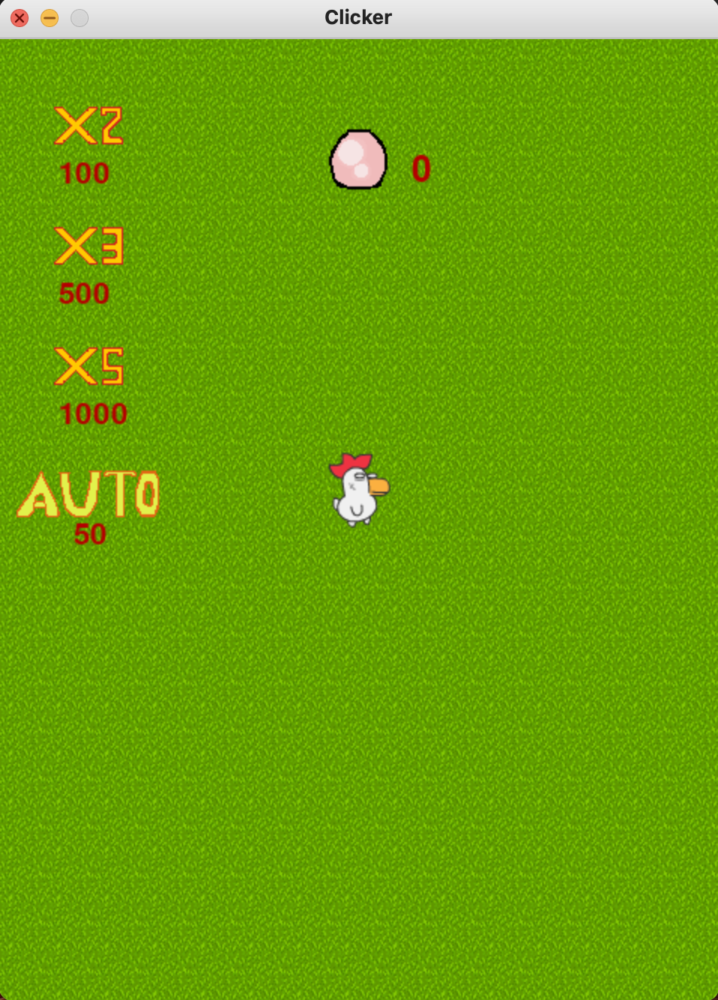

##	Clicker

###  **Description:**

You play as a farmer. Your general goal is to collect eggs. Save up points and buy upgrades to collect more eggs per click.

### **More detailed description:**

Incremental games, also known as clicker games, clicking games (on PCs) or tap games (in mobile games), are video games whose gameplay consists of the player performing simple actions such as clicking on the screen repeatedly. This "grinding" earns the player in-game currency which can be used to increase the rate of currency acquisition. In some games, even the clicking becomes unnecessary at some point, as the game plays itself, including in the player's absence, hence the moniker idle game.

###	**Control:**

`SPACE` - TAP

`Q` - use 2X tap bonus

`W` - use 3X tap bonus

`E` - use 5X tap bonus

`R` - add AUTOCLICK

### **How to play game:**

  Clone this repository
  
  Run in Terminal: python3 play.py

## Example

​
